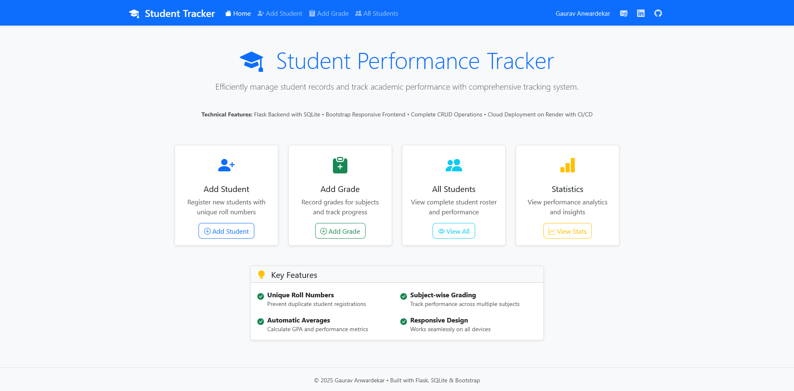
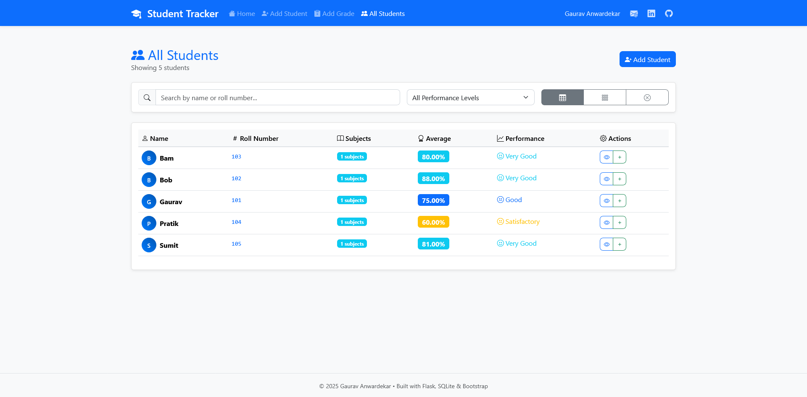
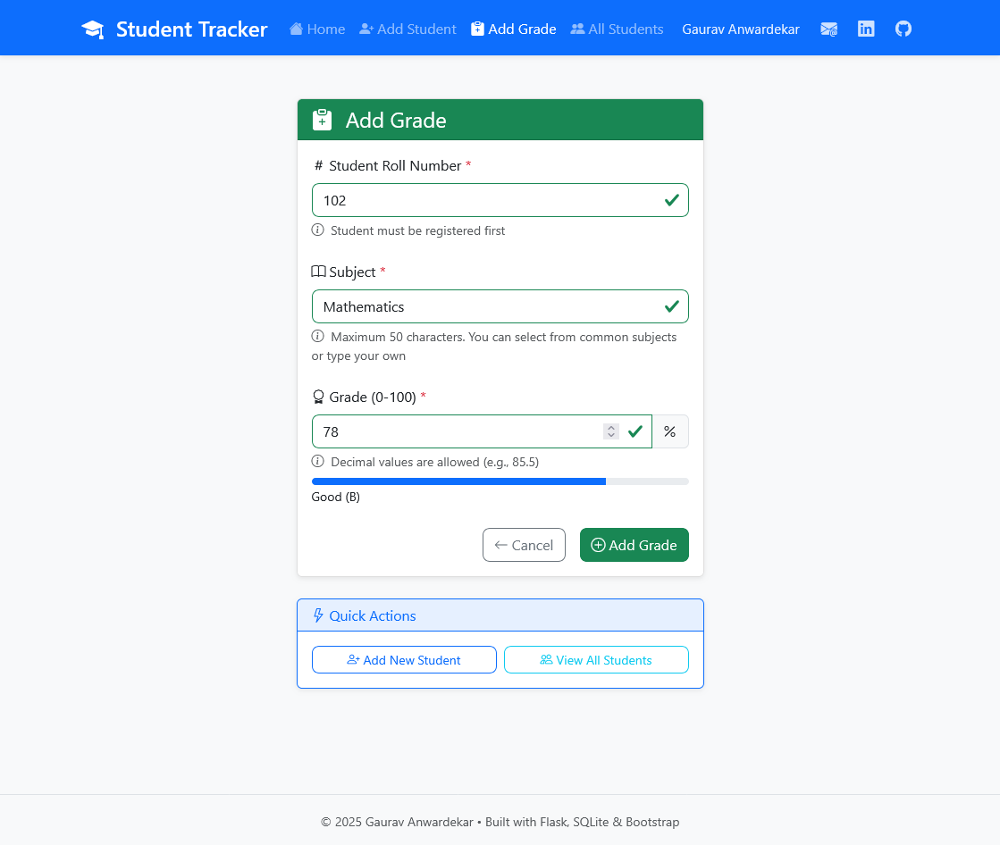
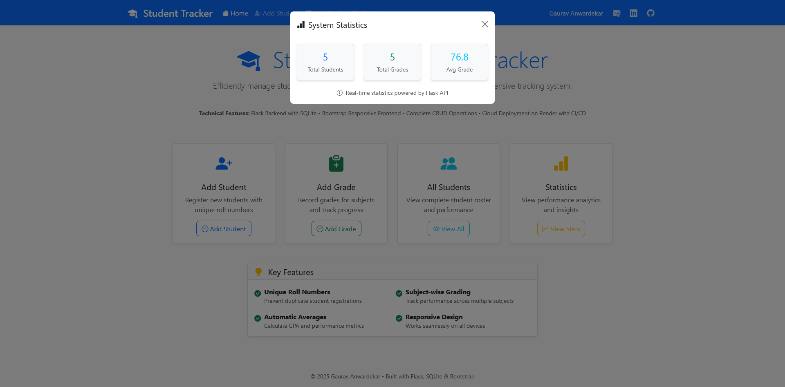

# 🎓 Student Performance Tracker

A robust, Flask-based web application designed to manage student records, subject grades, and academic performance metrics. This project demonstrates a raw SQL implementation within a Python web framework, featuring a responsive Bootstrap frontend and a concurrent-safe SQLite backend.

## 📸 Screenshots

| Dashboard | Student Roster |
| --- | --- |
|  |  |

| Grade Entry | Analytics |
| --- | --- |
|  |  |

---

## ⚙️ How the Code Works

This application is built on a **Model-View-Controller (MVC)** influenced architecture, separating data persistence, routing logic, and user interface presentation.

### 1. The Backend (Flask & Routing)

The entry point of the application is `run.py`. It initializes the Flask app and the `StudentTracker` database instance.

* **Routing:** The app maps URL endpoints (e.g., `/add_student`, `/add_grade`) to Python functions.
* **Validation:** Before any data reaches the database, `run.py` performs server-side validation. For example, it ensures grade inputs are floats between 0-100 and that roll numbers are not empty.
* **API Endpoint:** The `/api/statistics` route serves JSON data asynchronously, allowing the frontend to load stats without refreshing the page.

### 2. The Database Logic (Persistence Layer)

The core logic resides in `database.py`. Unlike projects using heavy ORMs (like SQLAlchemy), this project uses **raw SQLite3** queries for maximum control and transparency.

* **Thread Safety:** The `StudentTracker` class utilizes `threading.Lock()` to prevent race conditions during write operations (Concurrent CRUD), ensuring data integrity when multiple requests hit the server simultaneously.
* **Context Management:** A custom context manager `@contextmanager def get_connection(self)` handles the opening and closing of database connections. This ensures that even if an error occurs during a transaction, the connection is closed properly to prevent leaks.
* **Data Models:**
* **Students Table:** Stores `name` and a unique `roll_number`.
* **Grades Table:** Stores `roll_number` (acting as a foreign key), `subject`, and the numeric `grade`.
* **Indexing:** The initialization script automatically creates SQL indexes (`idx_roll_number`) to optimize query speeds for lookups.


### 3. The Frontend (Dynamic & Responsive)

* **Templating:** The app uses **Jinja2** templates (`base.html` inheritance) to render HTML on the server. This allows the backend to inject student data directly into the DOM before it reaches the browser.
* **JavaScript Automation:** `scripts.js` handles client-side behavior:
* **Real-time Validation:** Inputs provide immediate visual feedback (green/red outlines) as the user types.
* **Auto-Refresh:** The dashboard checks for data updates automatically every 4 minutes.
* **Client-Side Filtering:** The "All Students" table allows searching and filtering by performance level (e.g., "Excellent", "Needs Improvement") entirely in the browser without re-querying the database.


---

## 🚀 Key Features

* **Duplicate Prevention:** Enforces unique roll numbers at the database level to maintain record integrity.
* **Smart Grading:** Accepts decimal grades and validates range (0-100). Updates existing records if a subject grade is re-entered.
* **Performance Analytics:** Automatically calculates averages and assigns qualitative tags (Excellent, Good, Satisfactory) based on score thresholds.
* **Visual Indicators:** Progress bars and color-coded badges change dynamically based on the grade value (e.g., Green for >90%, Red for <60%).
* **Responsive Design:** Built with Bootstrap 5, ensuring the interface works on mobile, tablet, and desktop.

---

## 🛠️ Installation & Setup

### Prerequisites

* Python 3.9+
* pip

### Steps

1. **Clone the repository**
```bash
git clone https://github.com/yourusername/StudentTracker.git
cd StudentTracker

```


2. **Create a Virtual Environment**
```bash
python -m venv venv
# Windows
venv\Scripts\activate
# Mac/Linux
source venv/bin/activate

```


3. **Install Dependencies**
```bash
cd py-app
pip install -r requirements.txt

```


*Dependencies include Flask 3.1.0 and Gunicorn 20.1.0.*
4. **Run the Application**
```bash
python run.py

```


The application will start on `http://localhost:5000` (or the port defined in your environment variables).

---

## 📂 Project Structure

```text
StudentTracker/
├── README.md                 # Project Documentation
├── screenshots/              # Images for README
├── py-app/
│   ├── run.py                # Application Entry Point & Routes
│   ├── database.py           # Database Class & SQL Logic
│   ├── students.db           # SQLite Database File
│   ├── requirements.txt      # Python Dependencies
│   ├── static/
│   │   ├── css/
│   │   │   └── styles.css    # Custom Styling
│   │   └── js/
│   │       └── scripts.js    # Client-side Logic
│   └── templates/            # HTML Templates (Jinja2)
│       ├── base.html         # Base Layout
│       ├── home.html         # Dashboard
│       ├── add_student.html  # Registration Form
│       ├── add_grade.html    # Grade Entry Form
│       ├── view_student.html # Individual Student Report
│       └── view_all_students.html # Roster View

```

---

## 🔮 Future Improvements

* **Authentication:** Add login functionality for teachers/admins.
* **Export:** Add functionality to export the student list to CSV/Excel.
* **API Expansion:** Create a full REST API for third-party integrations.

---

**Built with Flask, SQLite, and Bootstrap.**
